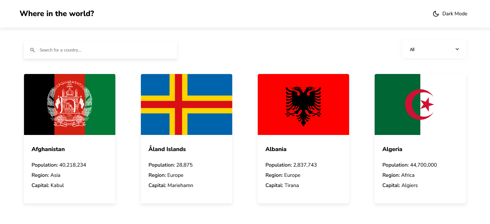
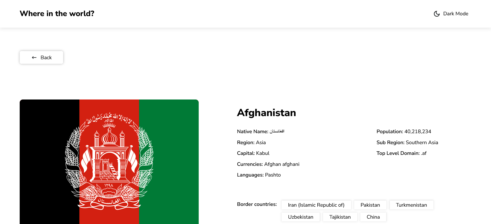

# Frontend Mentor - REST Countries API with color theme switcher solution

This is a solution to the [REST Countries API with color theme switcher challenge on Frontend Mentor](https://www.frontendmentor.io/challenges/rest-countries-api-with-color-theme-switcher-5cacc469fec04111f7b848ca). Frontend Mentor challenges help you improve your coding skills by building realistic projects.

## Table of contents

- [Overview](#overview)
  - [The challenge](#the-challenge)
  - [Screenshots](#screenshots)
  - [Links](#links)
- [My process](#my-process)
  - [Built with](#built-with)
  - [What I learned](#what-i-learned)
  - [Continued development](#continued-development)
  - [Useful resources](#useful-resources)
- [Author](#author)

## Overview

### The challenge

Users should be able to:

- See all countries from the API on the homepage
- Search for a country using an `input` field
- Filter countries by region
- Click on a country to see more detailed information on a separate page
- Click through to the border countries on the detail page
- Toggle the color scheme between light and dark mode *(optional)*

### Screenshots

### Links

- Solution URL: [GitHub Repository](https://github.com/yochainoah/rest-countriesapi)
- Live Site URL: [Live Demo](https://yochainoah.github.io/rest-countriesapi/#/)

## My process

### Built with

- Semantic HTML5 markup
- CSS custom properties
- Flexbox
- CSS Grid
- Mobile-first workflow
- [React](https://reactjs.org/) - JavaScript library for building user interfaces

### What I learned

I learned how to implement a custom dropdown menu without using <select> and <option> elements. This required managing state to show/hide the dropdown and using CSS positioning to control layout effectively.

### Continued development

I aim to further explore advanced CSS techniques and how they can enhance user interface design without heavy reliance on JavaScript.

### Useful resources

- [W3Schools](https://www.w3schools.com/) - Reference for CSS attributes and React concepts
- [Kevin Powell's YouTube Channel](https://www.youtube.com/user/KepowOb) - Great for learning practical CSS techniques and effects

## Author

- Portfolio: [Yochai Heinrich](https://www.your-site.com)
- Frontend Mentor: [@yochainoah](https://www.frontendmentor.io/profile/yochainoah)
